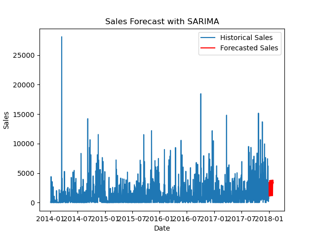

# Sales Forecasting for Revenue Growth

## Problem Statement
Businesses require accurate sales predictions to effectively plan inventory, allocate resources, and meet revenue targets. This project aims to analyze historical sales data to forecast future sales, thereby enhancing decision-making and revenue growth strategies.

## Model Performance plot

## Data Overview
The dataset used in this project is the [Kaggle Store Sales dataset](https://www.kaggle.com/datasets/competitions/store-sales-time-series-forecasting). 
It contains historical sales data for a retail store and includes the following key columns:
- **`Date`**: The date of each sales record.
- **`Sales`**: The total sales value for the day.
- Additional columns, such as promotions, holidays, and regional data, may influence sales and were considered during analysis.

## Data Preprocessing
- **Missing Values**: The dataset was inspected for missing values using `.isnull()`, confirming that no missing data was present. This ensured the integrity of the dataset for analysis.
- **Datetime Conversion**: The 'Date' column was transformed into a datetime format using `pd.to_datetime()`. This transformation was essential for performing time series analysis, enabling the identification of seasonal patterns and trends.
- **Outliers**: Outliers in the sales data were visually assessed through a scatter plot on the residuals and assessing ACF and PACF. Extreme values were capped where necessary to prevent them from distorting the model’s performance.

## Exploratory Data Analysis (EDA)
- **Trend & Seasonality**: Visual analysis of the sales data revealed clear seasonal patterns with noticeable peaks during specific months, a typical trend in retail sales (e.g., holiday seasons, promotions).
- **Stationarity Check**: The Augmented Dickey-Fuller (ADF) test was applied to check the stationarity of the time series. The null hypothesis was that the series is non-stationary. The p-value from the ADF test indicated that the series was already stationary, and no differencing was needed. 

## Model Selection
- **SARIMA Model**: The Seasonal AutoRegressive Integrated Moving Average (SARIMA) model was selected due to its effectiveness in handling both trend and seasonality in time series data. This model integrates autoregressive (AR) and moving average (MA) components while accounting for seasonality.
  - The model was parameterized as follows:
    - **Non-seasonal**: (p=1, d=1, q=1)
    - **Seasonal**: (P=1, D=1, Q=1, S=7), where `S=7` was chosen to account for weekly seasonality, which is relevant in retail sales.
- **Rationale for SARIMA**: SARIMA was preferred over models like ARIMA and Exponential Smoothing due to its ability to capture periodic patterns and the underlying trend in the dataset.
  
## Model Performance
- **Residual Analysis**: Following model fitting, residual diagnostics were conducted using autocorrelation (ACF) plots and histogram checks to ensure that the residuals were uncorrelated and resembled white noise. This confirmed that the model had effectively captured the structure of the data. Upon analyzing the ACF plot of the residuals, it was observed that most data points fell within the confidence intervals, indicating no significant autocorrelation. However, 1 data point was found to be outside the confidence intervals, suggesting minor but non-negligible autocorrelation at that specific lags.
- **Forecasting**: The SARIMA model was used to forecast sales for the next 30 days. The forecasted values were compared with actual sales data, and the visual comparison demonstrated the model’s ability to replicate general sales trends, though it smoothed out extreme peaks.
- **Model Validation**: The SARIMA model was directly fitted on the entire dataset, and forecast values were generated for the next 30 days. The model's performance was visually assessed by comparing the forecasted sales to historical trends.

## Results
- **Forecasting Accuracy**: The SARIMA model successfully predicted sales trends, capturing the seasonal fluctuations in the data. While the model effectively predicted general trends, it smoothed out sharp sales spikes due to its focus on average behavior.
- **Visualizations**: The historical and forecasted sales data were plotted together to provide a clear visual representation of the model’s accuracy and performance.

## Conclusion
This project demonstrates the successful application of the SARIMA model for time series forecasting in retail sales. The model accurately captured the seasonal trends and overall growth in the sales data, providing a solid basis for forecasting future sales.

## Next Steps
- **Model Improvement**: Further testing of alternative models, such as ARIMA and Long Short-Term Memory (LSTM) networks, is planned to compare performance. Fine-tuning of SARIMA parameters could also improve forecast accuracy.
- **Further Data Analysis**: Future work will involve incorporating additional external factors, such as promotions, holidays, and regional effects, into the model for more precise forecasts. The use of machine learning models, such as Random Forest or XGBoost, will also be explored for hybrid forecasting.

## Skills Showcased
- **Data Analysis**: Proficient handling of missing values, outliers, and conducting exploratory analysis to understand the dataset's structure.
- **Time Series Forecasting**: In-depth model selection, parameter tuning, and validation to demonstrate the understanding of SARIMA’s components and their relevance to the sales data.
- **Data Visualization**: Effective use of matplotlib and seaborn to communicate insights through visual representations of historical and forecasted data.
- **Model Tuning & Validation**: Proper implementation of validation strategies and residual checks to ensure model robustness and predictive reliability.

